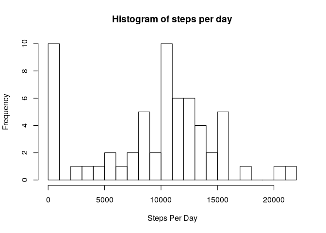
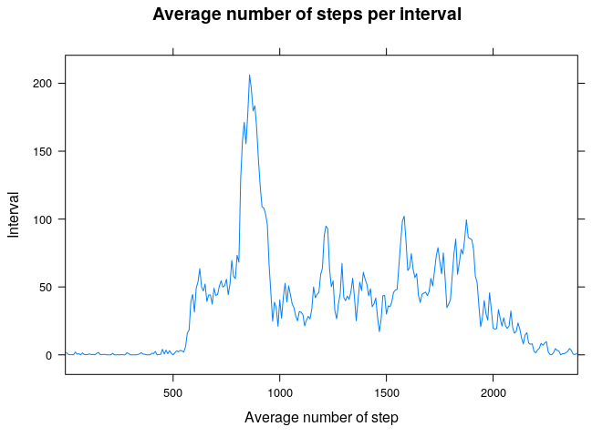
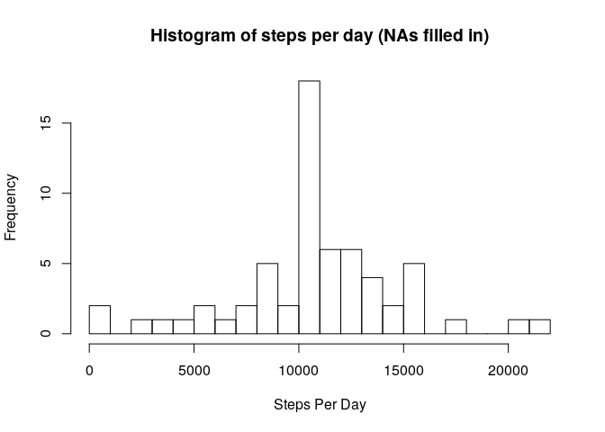
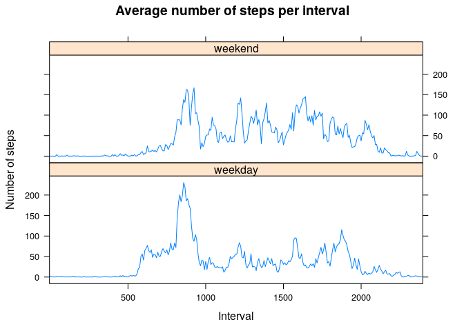

## Loading and preprocessing the data

NB. This assumes that activity.zip is in the same folder as the Rmd script. 
The data is first unzipped and loaded up with read.csv:  


```r
unzip("activity.zip")
activity <- read.csv("activity.csv")
```

## What is mean total number of steps taken per day?

Firstly the total number of steps per day is calculated:  


```r
stepsPerDay <- tapply(activity$steps, activity$date, sum, na.rm = TRUE)
```

Secondly, a histogram is generated of the total number of steps per day.  
NB. For dates with only NAs, the total is assumed to be zero:  


```r
hist(stepsPerDay, xlab = "Steps Per Day", 
     main = "Histogram of steps per day", breaks = 20)
```

<!-- -->

Finally, the mean and median of the total number of steps is calculated.  
NB. For dates with only NAs, the total is assumed to be zero.  


```r
meanSteps <- mean(stepsPerDay)
medianSteps <- median(stepsPerDay)
```
The mean is 9354.2295082 and the median is 10395. 

## What is the average daily activity pattern?

Firstly, calculate the average across each interval, and plot:  


```r
library(dplyr)
```

```
## 
## Attaching package: 'dplyr'
```

```
## The following objects are masked from 'package:stats':
## 
##     filter, lag
```

```
## The following objects are masked from 'package:base':
## 
##     intersect, setdiff, setequal, union
```

```r
library(lattice)
avgPerInterval <- activity %>% group_by(interval) %>% 
                  summarize(steps = mean(steps, na.rm = TRUE))
```

```
## `summarise()` ungrouping output (override with `.groups` argument)
```

```r
#plotting with interval as factors to ensure correct scaling of x-axis
#(i.e. no gap between 55 and 0)
xyplot(steps ~ as.factor(interval), data = avgPerInterval, type = "l", 
       ylab = "Interval",
       xlab = "Average number of step",
       main = "Average number of steps per interval",
       scale = list(x = list(at = c(61, 121, 181, 241))))
```

<!-- -->

Secondly, calculate the interval with the highest value:  


```r
maxInterval <- avgPerInterval$interval[which.max(avgPerInterval$steps)]
```
The 5-minute interval with the maximum value is 835.  

## Imputing missing values

Firstly, calculate number of NA values for steps:  

```r
numberOfNAs <- sum(is.na(activity$steps))
```
The number of NAs is 2304.  

Secondly, a new dataset is created, wherein the missing values are filled in
with the average for that time interval.  


```r
filledActivity <- activity #copy data frame
isNA <- is.na(filledActivity$steps) #get na indices
#replace NAs with average as stored in avgPerInterval
for (index in 1:dim(filledActivity)[1]) {
  if (isNA[index]) {
    filledActivity$steps[index] <-
      avgPerInterval$steps[which(avgPerInterval$interval ==
                                   filledActivity$interval[index])]
  }
}
```

Next, get the total number of steps per day:


```r
stepsPerDayFilled <- tapply(filledActivity$steps, filledActivity$date, sum)
```

Plot a histogram of this:  


```r
hist(stepsPerDayFilled, xlab = "Steps Per Day", 
     main = "Histogram of steps per day (NAs filled in)", breaks = 20)
```

<!-- -->

And calculate the mean and median:  


```r
meanStepsFilled <- mean(stepsPerDayFilled)
medianStepsFilled <- median(stepsPerDayFilled)
```
The mean is 10766.19 and the median is 10766.19.  

## Are there differences in activity patterns between weekdays and weekends?

Firstly, add new weekday/weekend factor variable to filledActivity:  


```r
dayType <- weekdays(as.Date(filledActivity$date))
dayType[startsWith(dayType, "S")] <- "weekend"
dayType[dayType != "weekend"] <- "weekday"
filledActivity$day.type <- as.factor(dayType)
```

Then generate a lattice plot based on this factor:  


```r
avgs <- filledActivity %>%
        group_by(interval, day.type) %>%
        summarize(steps = mean(steps))
```

```
## `summarise()` regrouping output by 'interval' (override with `.groups` argument)
```

```r
xyplot(steps ~ as.factor(interval) | day.type, data = avgs, type = "l", 
       layout = c(1,2),
       xlab = "Interval",
       ylab = "Number of steps",
       main = "Average number of steps per interval",
       scales = list(x = list(at = c(61, 121, 181, 241))))
```

<!-- -->
